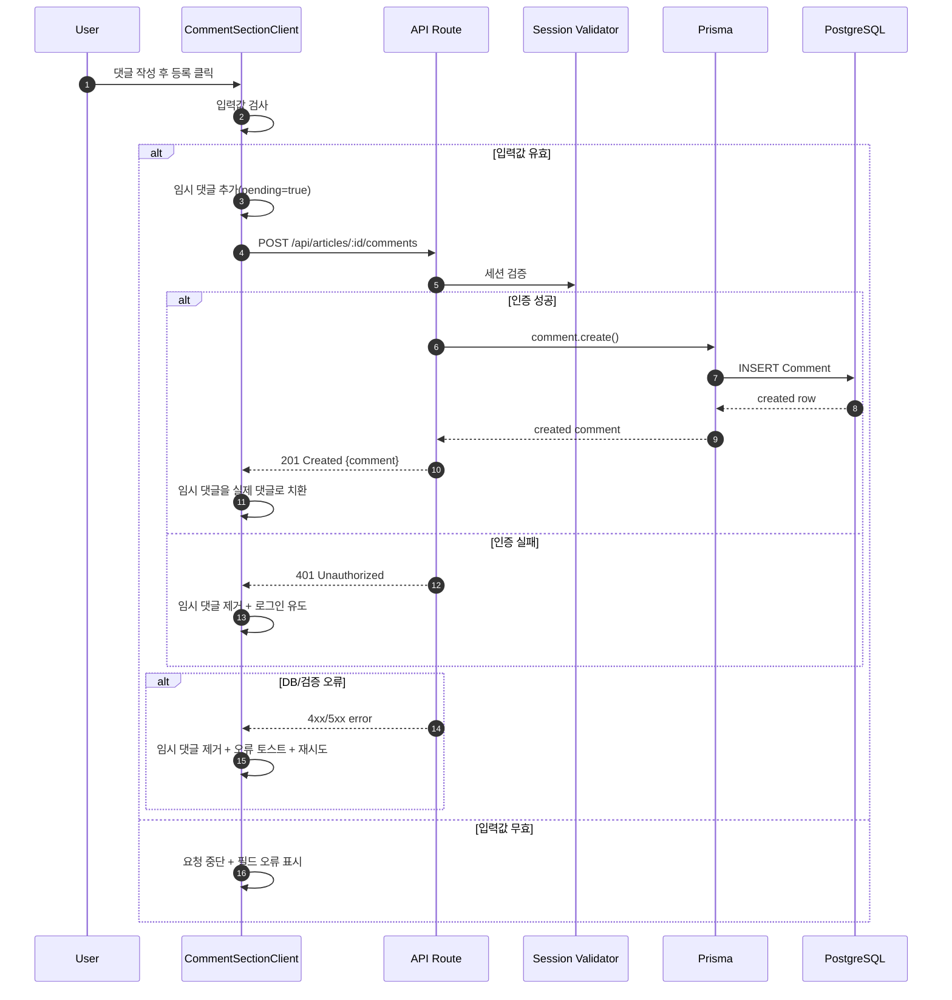
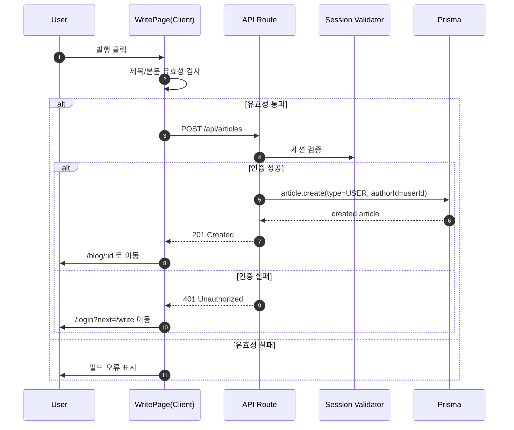

# 07-sequence-diagram.md (시퀀스 다이어그램)

핵심 상호작용의 시간 순서와 실패 처리(rollback)를 정의합니다.

---

## 댓글 작성: `POST /api/articles/:id/comments`

```mermaid
sequenceDiagram
    autonumber
    participant User as User
    participant UI as CommentSectionClient
    participant API as API Route
    participant Auth as Session Validator
    participant Prisma as Prisma
    participant DB as PostgreSQL

    User->>UI: 댓글 작성 후 등록 클릭
    UI->>UI: 입력값 검사

    alt 입력값 유효
        UI->>UI: 임시 댓글 추가(pending=true)
        UI->>API: POST /api/articles/:id/comments
        API->>Auth: 세션 검증

        alt 인증 성공
            API->>Prisma: comment.create()
            Prisma->>DB: INSERT Comment
            DB-->>Prisma: created row
            Prisma-->>API: created comment
            API-->>UI: 201 Created {comment}
            UI->>UI: 임시 댓글을 실제 댓글로 치환
        else 인증 실패
            API-->>UI: 401 Unauthorized
            UI->>UI: 임시 댓글 제거 + 로그인 유도
        end

        alt DB/검증 오류
            API-->>UI: 4xx/5xx error
            UI->>UI: 임시 댓글 제거 + 오류 토스트 + 재시도
        end
    else 입력값 무효
        UI->>UI: 요청 중단 + 필드 오류 표시
    end
```

---

## 새 글 발행: `POST /api/articles`

```mermaid
sequenceDiagram
    autonumber
    participant User as User
    participant WritePage as WritePage(Client)
    participant API as API Route
    participant Auth as Session Validator
    participant Prisma as Prisma

    User->>WritePage: 발행 클릭
    WritePage->>WritePage: 제목/본문 유효성 검사

    alt 유효성 통과
        WritePage->>API: POST /api/articles
        API->>Auth: 세션 검증

        alt 인증 성공
            API->>Prisma: article.create(type=USER, authorId=userId)
            Prisma-->>API: created article
            API-->>WritePage: 201 Created
            WritePage->>User: /blog/:id 로 이동
        else 인증 실패
            API-->>WritePage: 401 Unauthorized
            WritePage->>User: /login?next=/write 이동
        end
    else 유효성 실패
        WritePage->>User: 필드 오류 표시
    end
```
